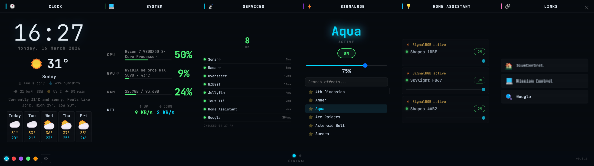
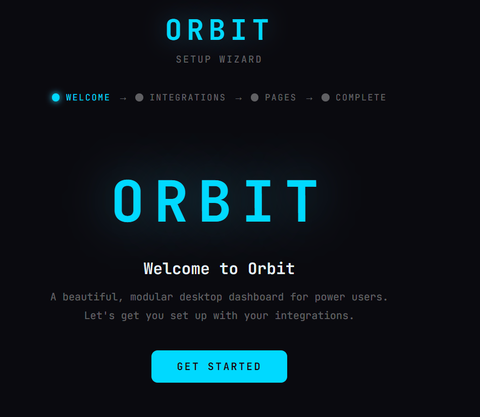
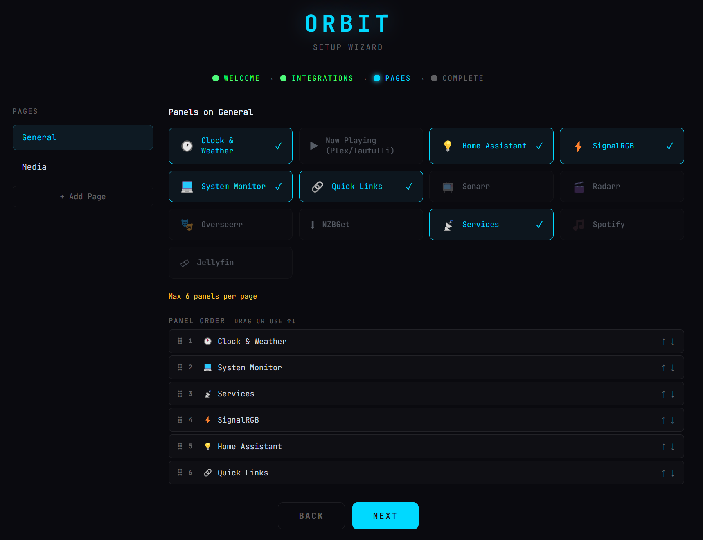

<div align="center">

# Orbit

**One screen for your entire homelab.**

[](https://github.com/exce55ive/orbit-display/releases/tag/v0.1.0)
[](https://github.com/exce55ive/orbit-display/releases/latest)
[](LICENSE.md)
[](https://orbit.exce55ive.xyz)

</div>

---

_Designed for the Corsair Xeneon Edge — should work on other displays._

Orbit is a modular desktop dashboard for Windows, built for homelab users who are done Alt‑Tabbing between Sonarr, Home Assistant, Plex, and a dozen other browser tabs. You wire up your services once — media stack, home automation, RGB lighting, download queues, system stats — and Orbit keeps everything visible on a single screen of panels you arrange yourself.

It runs locally. It talks directly to your LAN services. Config stays on your machine. No cloud, no account, no telemetry.

---

<div align="center">



<details>
<summary>More screenshots</summary>

<br>

**Boot sequence**


**Setup wizard — Welcome**


**Setup wizard — Pages**


</details>

</div>

---

## ⬇ Download

**[→ GitHub Releases](https://github.com/exce55ive/orbit-display/releases/latest)** — grab the latest `OrbitSetup-x.x.x.exe` from there.

Windows 10/11 x64 · installs silently · creates Desktop & Start Menu shortcut

On first launch, a setup wizard walks you through connecting your services. After that, the dashboard loads automatically.

---

## Panels

| | Panel | What it shows |
|---|---|---|
| 🕐 | **Clock & Weather** | Local time, current conditions, 5‑day forecast via wttr.in + Open‑Meteo |
| ⚡ | **SignalRGB** | Effect browser, search, favourites, brightness slider |
| 💡 | **Home Assistant** | Toggle lights, set brightness, pick entities |
| ▶️ | **Now Playing** | Tautulli / Plex sessions — album art, track progress |
| 💻 | **System Monitor** | CPU, RAM, GPU, network — live |
| 🔗 | **Quick Links** | Configurable shortcut buttons to anything |
| 📺 | **Sonarr** | Upcoming episodes, queue, import status |
| 🎬 | **Radarr** | Upcoming movies, queue, import status |
| 🎭 | **Overseerr** | Recent media requests |
| ⬇️ | **NZBGet** | Download speed, queue, progress bars |
| 🎵 | **Spotify** | Now playing, progress, queue preview |
| 🎞️ | **Jellyfin** | Active sessions and playback |
| 📡 | **Services** | Health monitor for custom HTTP endpoints |
| 🖥️ | **Proxmox** | VM/container status, node CPU/RAM/storage |
| 🐳 | **Docker** | Running/stopped containers with CPU and memory stats |
| 🕳️ | **Pi-hole** | Query stats, block percentage, enable/disable toggle |
| 🗄️ | **TrueNAS** | Pool status, disk health, system info, recent alerts |
| 📸 | **Immich** | Photo library stats, recent upload, On This Day |
| 🚀 | **Speedtest** | Download/upload/ping with history chart |
| 📅 | **Calendar** | Upcoming events from iCal feeds (Google, Outlook, Nextcloud) |
| 🌐 | **Network Monitor** | WAN status, ping latency, live speeds, router stats |
| 🟠 | **Unraid** | Array status, disk temps, VM list, parity check progress |
| 📊 | **Uptime Kuma** | Service health badges for all monitored endpoints |
| 🎬 | **Plex** | Active sessions and playback |
| 🌐 | **Custom / Embed** | Embed any URL as a panel (iframe/webview) |

Up to **6 panels per page**, across multiple pages. Drag‑and‑drop to reorder. Navigate pages via the bottom bar.

---

## Integrations

Everything is configured through the built‑in setup wizard — enter a URL and an API key, and you're connected.

| Service | What you need |
|---|---|
| **Sonarr** | URL + API key |
| **Radarr** | URL + API key |
| **Overseerr** | URL + API key |
| **NZBGet** | URL + password |
| **Tautulli / Plex** | Tautulli URL + API key |
| **Home Assistant** | URL + long‑lived access token |
| **SignalRGB** | Local HTTP API (default `http://localhost:16034`) |
| **Spotify** | OAuth flow — local callback at `http://127.0.0.1:8888/callback` |
| **Jellyfin** | URL + API key |
| **Proxmox** | URL + API token (`user@realm!tokenid=secret`) |
| **Docker** | Docker socket or TCP endpoint URL |
| **Pi-hole** | URL + API key (v5 or v6) |
| **TrueNAS** | URL + API key |
| **Immich** | URL + API key |
| **Speedtest** | No config — uses Cloudflare speed endpoints |
| **Calendar** | iCal feed URL (Google, Outlook, Nextcloud, Apple Calendar) |
| **Network Monitor** | Optional router URL (OpenWrt, pfSense, UniFi) + credentials |
| **Unraid** | URL + API key |
| **Uptime Kuma** | URL + API key |
| **Weather** | City name (free — no key required) |
| **Custom / Embed** | Any URL — just paste it in |

---

## v0.1.0 Features

- **Add Panel Gallery** — Visual panel picker. Click **+** to browse all panel types with descriptions and add panels without opening Settings.
- **Config Backup & Restore** — Export your full config as JSON and import it on another machine. Settings → System → Backup.
- **Custom / Embed Panel** — Drop any URL into a panel. Grafana dashboards, custom monitoring pages, anything with a web interface.

---

## Themes

| Theme | Accent |
|---|---|
| **Midnight** (default) | Cyan |
| **Carbon** | Red |
| **Nebula** | Purple |
| **Forest** | Green |
| **Ember** | Orange |

Accent colour and panel spacing are adjustable in Settings.

---

## Development

```bash
git clone https://github.com/exce55ive/orbit-display.git
cd orbit-display
npm install
npm start
```

For architecture details, the `window.orbit` API, and how to add panels — see **[docs/ARCHITECTURE.md](docs/ARCHITECTURE.md)**.

---

## License

Proprietary — © 2026 Exce55ive Software. All rights reserved.
Redistribution, resale, or sublicensing is not permitted without written permission.

See [`LICENSE.md`](LICENSE.md) for details.

---

<div align="center">

**[Website](https://orbit.exce55ive.xyz)** · **[Download](https://github.com/exce55ive/orbit-display/releases/latest)** · **[Report a Bug](https://github.com/exce55ive/orbit-display/issues)**

</div>
